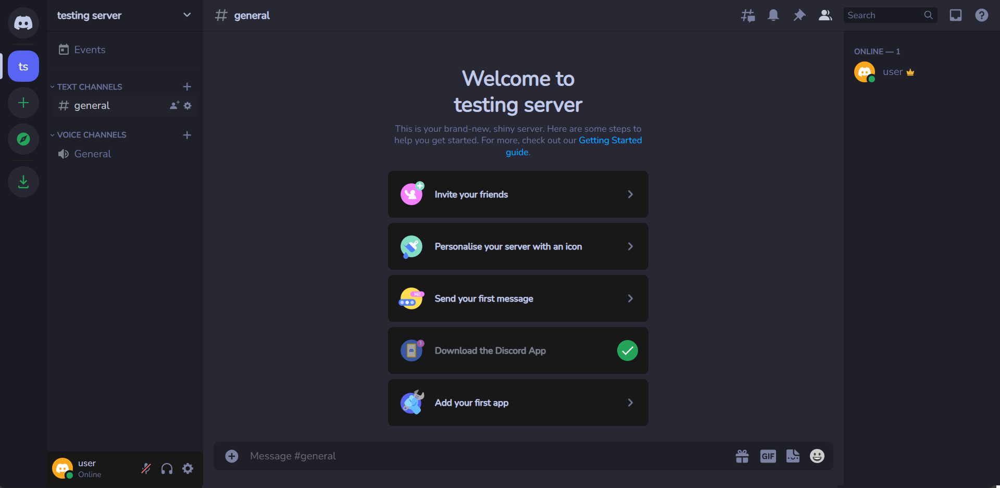

# DarkNight

A clean, simple and dark Discord theme.

## Support this repository:

- ⭐ **Star this repository:** It means a lot to me! 💕

## Installation:

### BetterDiscord:

1. **Download the Theme:**
   - [darknight.theme.css](./darknight.theme.css).
2. **Place the Theme:**
   - Place the downloaded theme file into BetterDiscord's themes folder.
3. **Enable the Theme:**
   - Go to User Settings.
   - Under the BetterDiscord section, click the Themes tab.
   - Enable the 'DarkNight' theme.

### Vencord:

1. **Download the Theme:**
   - [darknight.theme.css](darknight.theme.css).
2. **Upload the Theme:**
   - Go to User Settings.
   - Under the Vencord section, click the Themes tab.
   - Click 'Upload Theme' and select the downloaded file.
3. **Enable the Theme:**
   - Enable the 'DarkNight' theme.
